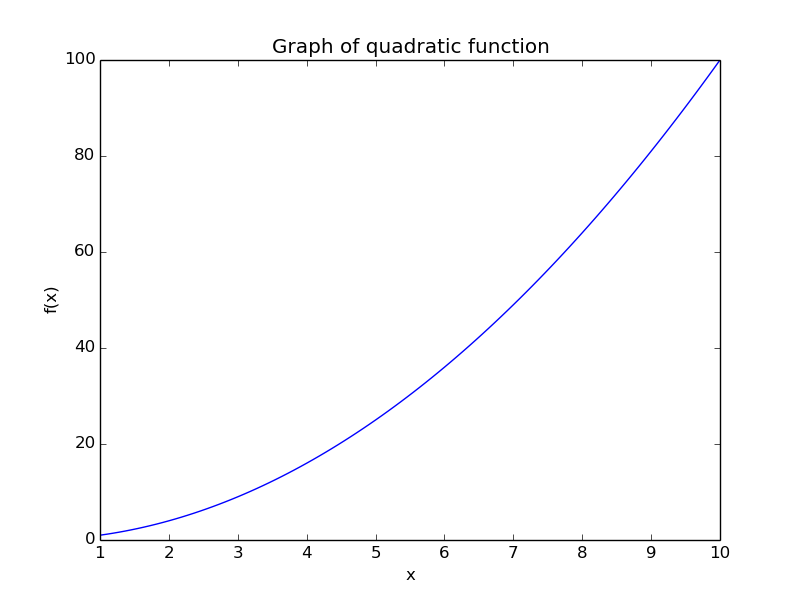
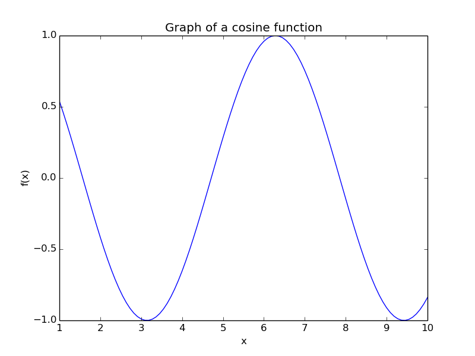
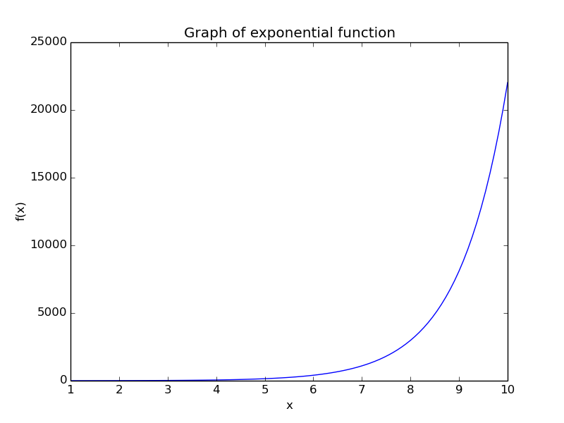
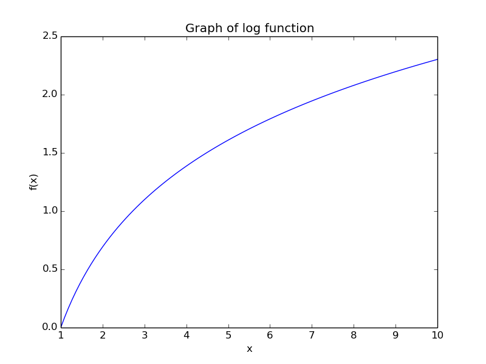
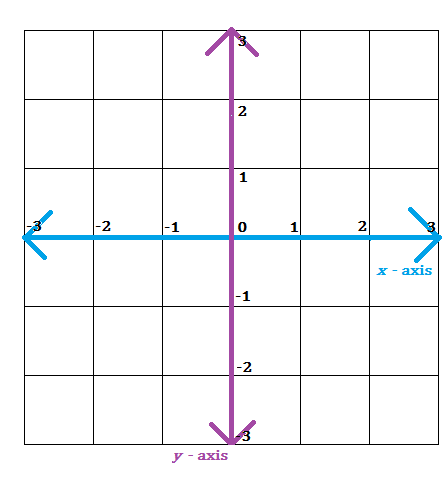

# STEP_session_2
Algebra, Geometry, Calculus

## Preliminaries
The goal of this session is to give you all a big picture view of what algebra and geometry, how it enables us to use concepts from calculus in interesting ways, and why it is a useful tool to keep sharp in your mathematical toolkit. Before diving into the focus of this session, we will take a look at some of the fundamental concepts that these topics build on. Many of these concepts will be familiar to you all, but I will present them here for the sake of completeness.

### Functions
In its most general sense, a function is a mapping of one collection of objects to another collection of objects. Typically, the collection of objects in interest are numbers, and the way we map one set of numbers to another set of numbers usually follows some rule that might be specified in either words or symbols. It is typically ideal to specify a function in symbols since it is more difficult to confuse what one means in mathematical symbols than it is to confuse the meaning of words. However, most real world / interesting problems require astute mathematicians to translate a problem from words into symbols that can be manipulated in ways that allow us to make interesting observations about the problem. An example of a function that we might specify using words would be "the kinetic energy of a moving object is proportional to the square of the velocity of the object". In symbols, this would be 
$$E \propto v^2$$
The little squiggly symbol in the middle of the letters means "is proportional to". Not only is the symbolic, mathematical way of writing the function smaller (it takes less characters to write the same idea), but it is also in a form that is ready for manipulation. It is very easy to make mistakes when translating from words to mathematical symbols, so I would advise you all to be patient and careful when translating words to symbols to ensure that a trivial (yet understandable) mistake occurs early in the process and invalidates all of the quality work you do afterwords (and often leaves you with a flat out incorrect answer). 

#### Analytic Functions
There are truly lots of different types of functions out there. At this point in your mathematical careers, however, the primary focus of your attention is centered around a small group of "analytic functions". Analytic function has a precise definition, but for now you can think of the ones we are focusing on as the functions that you can draw on a graph without lifting up your pencil. These functions are the polynomials, the trig functions (like cosine, sine, cosecant, etc), exponential functions, and logarithmic functions. Symbolically, 
$$\textbf{Polynomials}$$
$$f(x) = x^2$$
$$f(x) = 5x^3 - 9x^2 + 12$$

$$ \textbf{Trigonometric} $$
$$f(x) = cos(x)$$
$$f(x) = 12tan(x) - 6csc(7x) + 3$$
$$\textbf{Exponential and Logarithmic}$$
$$f(x) = e^x$$
$$f(x) = log(x)$$
$$f(x) = 8e^{9x}$$
$$f(x) = -5log(7x)$$

As you all learn calculus, you will become VERY comfortable with these functions. These functions are nice because they are very straightforward to analyze and usually have a derivative and integral that make sense for all numbers (logarithms are an exception because they are only defined for non-negative numbers). 

### Binary Operators
Binary operators are those little symbols that you usually see in between numbers. For example, the plus sign, +, is a binary operator. Other examples of binary operators are * , - , and ÷ (the multiplication, subtraction, and division symbols). Let's focus on the plus sign for a second. The plus sign takes two numbers and transforms them in a way to produce a new number. Addition is essentially an abstract way of respresenting how to combine a group of objects together. For example, if we combine 2 apples with 3 apples, and then count all of those apples up, we now have 5 apples. This process of combining like objects can be applied in a wide variety of other scenarios. Maybe we want to combine 2 bricks with 3 bricks. Although we are now working with bricks, the combination of the group of bricks leads to 5 total bricks if we count them all up (please bear with me here, we will get to more interesting stuff very soon). We see there is a similarity that generally applies when we combine objects of the same type. Just as addition provides a systematic way of combining objects together of the same type, subtraction is a systematic way of removing objects from another set of objects (both objects must be of similar type, for example you can't remove 2 apples from 3 bricks).

The interesting thing about addition and subtraction is that in a very abstract sense, the represent a way of "undoing" each other. If you have 2 bricks and add 3 bricks, then you have 5 bricks. If you now subtract 3 bricks from the 5 bricks you now have, you are left with 2 bricks (what you started with). 
### Graphs
Graphs are a means of visualizing functions. By looking at a graph, we can often times observe trends and interesting points for observation (like minimum or maximum values). We can also graph two functions on the same plot and observe things like how functions grow relative to each other, where different functions have different (or the same) minimum/maximum values, etc. Pictured below are the small set of analytic functions mentioned earlier. These graphs were generated with the python file in the code directory. Feel free to look at the code, make changes (dont worry you wont break it), and try to run the code after you make changes.  

A graph is simply an intersection of perpendicular axes. A graph should ALMOST ALWAYS be labeled, unless it is SELF_EVIDENT to the audience (whom you are presenting the graph to) what the axes are. Typically, people like to use x as a variable and y=f(x) as the value of a function given a certain value. The x-axis is usually reserved for the independent variable, x, while the y-axis is usually reserved for the dependent variable, y=f(x). Hopefully you can see why the axes are named as such. 

## Geometry

## Algebra

## Calculus

## References / Resources
